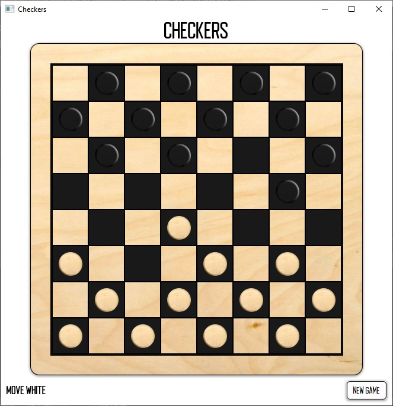

# JavaFXCheckers
Checkers game - an individual project implemented as part of the Kodilla course.

## General info
The game is played with a computer. A simple minimax algorithm is responsible for the computer movements.

## Installation
Clone this repo to your local machine using [https://github.com/PawelM-code/JavaFXCheckers.git](https://github.com/PawelM-code/JavaFXCheckers.git)

## Screenshot

## Technologies
Project is created with:
* Java jdk 8
* JUnit 5.3
* Mockito 1.10.19
